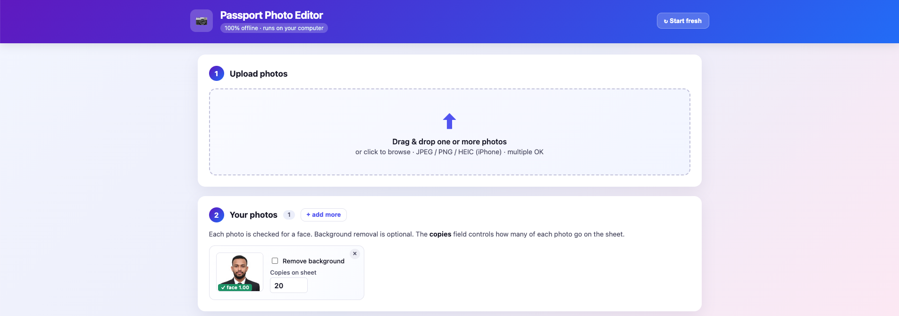
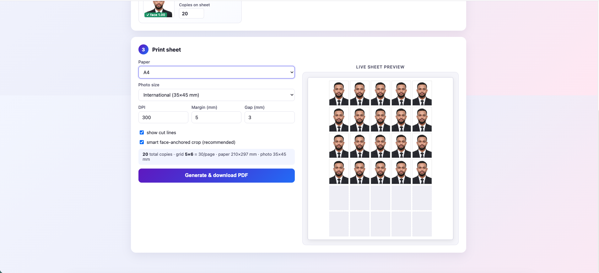

# Passport Photo Editor

Local, fully-offline web app for making passport / visa photos.

Drop in **one or many** photos → it auto-detects the face, optionally removes
the background and applies a chosen color → tiles them onto a printable
sheet (A4, A3, Letter, 4×6, 5×7, 4×5) with smart face-anchored cropping →
downloads as a multi-page PDF at 300 DPI.

Runs as a Python server on `127.0.0.1`. After the one-time install, no
internet connection is needed. The server auto-starts every time you log in
and opens the web page in your browser.

---

## Screenshots

**Upload + per-photo controls** — drag-drop multiple photos, each with its
own face badge, optional background removal, color palette, and copies count.



**Print sheet with live preview** — pick paper, photo size, DPI, margin, gap.
The right pane shows exactly what the printed page will look like, and
updates as you tweak the controls.



---

## Features

- **Multiple photos per sheet** — upload several, choose how many copies of
  each. Default is 20 copies split evenly across uploaded photos.
- **HEIC / iPhone photo support** with automatic EXIF rotation.
- **Optional background removal** (U²-Net) per photo, with a 12-color
  palette of passport-relevant backgrounds plus a custom color picker.
- **Smart face-anchored cropping** — face fills ~55% of the output photo
  height, with a small upward bias for forehead room. No more squashed
  faces from aspect-ratio mismatch.
- **Multi-page PDF** — overflow copies automatically continue on page 2, 3, …
- **Live SVG preview** of the printed page that updates instantly as you
  change paper size, photo size, margin, or gap.
- **100% offline** after the one-time install. Nothing leaves `127.0.0.1`.
- **Auto-start on every login** (macOS LaunchAgent / Windows Startup folder).
- **One-click "Start fresh"** button to clear the session.

---

## What's in the box

| File | Purpose |
|------|---------|
| `server.py` | Flask backend: face detect, bg remove, smart crop, PDF sheet |
| `static/` | Web UI (HTML + JS + CSS) |
| `requirements.txt` | Python dependencies |
| `install.sh` / `install.bat` | One-click installer (macOS/Linux / Windows) |
| `start.sh` / `start.bat` | Starts server + opens browser |
| `uninstall.sh` / `uninstall.bat` | Removes the autostart entry |
| `docs/` | Screenshots used in this README |
| `.gitignore` | Ignores venv, caches, logs |

---

## Requirements

- **Python 3.9 or newer** (3.10–3.12 recommended). Get it from
  <https://www.python.org/downloads/>. On Windows, **tick "Add Python to
  PATH"** during install.
- Internet connection for the *first* install only (downloads pip packages
  and the ~170 MB U²-Net background-removal model). After that, everything
  runs offline.
- ~1.5 GB free disk for the venv + model.

---

## Install — macOS / Linux

```bash
cd /path/to/passporteditor
chmod +x install.sh start.sh uninstall.sh
./install.sh
```

The installer will:

1. Pick the newest Python ≥ 3.9 it can find.
2. Create a `venv/` and install all dependencies.
3. Pre-download the background-removal model so the app stays offline later.
4. Verify all imports.
5. On macOS, install a **LaunchAgent** at
   `~/Library/LaunchAgents/com.passporteditor.plist` so the server runs at
   every login and respawns if it crashes.
6. Launch the server and open <http://127.0.0.1:5005> in your browser.

That's it.

---

## Install — Windows

1. Open the folder in File Explorer.
2. Double-click **`install.bat`**.
3. Wait for it to finish (a few minutes; downloads ~500 MB).

The installer will:

1. Find Python via the `py` launcher (or `python.exe`).
2. Create a `venv\` and install dependencies.
3. Pre-download the background-removal model.
4. Drop a shortcut **`PassportEditor.lnk`** into your Startup folder
   (`%APPDATA%\Microsoft\Windows\Start Menu\Programs\Startup\`) so the
   server runs at every login.
5. Launch the server and open <http://127.0.0.1:5005>.

---

## Daily use

After install, just log in to your computer. The server starts automatically
and the browser tab opens.

To launch manually any time:

- macOS / Linux: `./start.sh`
- Windows: double-click `start.bat`

The web page is at **<http://127.0.0.1:5005>**.

### Workflow inside the web page

1. **Upload** — drag and drop one or more photos (JPEG, PNG, HEIC), or
   click the dropzone to browse. iPhone photos with sideways orientation
   are auto-rotated.
2. **Per-photo card** — each photo gets a card showing:
   - face-detection badge (green if found),
   - optional **Remove background** toggle. When enabled, a mini color
     palette and custom-color picker appear,
   - **Copies on sheet** counter (defaults set so total ≈ 20).
3. **Print sheet** — choose paper, photo size, DPI, margin, gap. The live
   preview on the right shows the exact layout. Toggle **smart
   face-anchored crop** (recommended) for ID-style framing.
4. Click **Generate & download PDF**. Multi-page PDFs are produced
   automatically when the requested copies exceed page capacity.
5. Open the PDF and print at **100% / actual size** — do *not* let the
   printer scale-to-fit, or the photos will be the wrong physical size.

Use **↻ Start fresh** in the header to clear all photos and begin a new
session.

### Photo sizes shipped

| Key | Dimensions | Common use |
|-----|------------|-----------|
| `passport_us_2x2` | 51 × 51 mm | US passport |
| `passport_intl_35x45` | 35 × 45 mm | Most countries |
| `visa_uk_35x45` | 35 × 45 mm | UK visa |
| `visa_schengen_35x45` | 35 × 45 mm | Schengen visa |
| `india_35x35` | 35 × 35 mm | India |
| `china_33x48` | 33 × 48 mm | China |

Add more by editing `PHOTO_SIZES_MM` in [server.py](server.py).

---

## Configuration

- **Port** — default `5005`. Override:
  - macOS/Linux: `PORT=6000 ./start.sh`
  - Windows: edit `start.bat` and change `set "PORT=5005"`
- **DPI / margins / cut lines / smart crop** — tunable from the web page UI.

---

## Troubleshooting

**"Python 3.9 or newer is not installed"**
Install Python from <https://www.python.org/downloads/>. On Windows tick
"Add Python to PATH". Then re-run the installer.

**Browser doesn't open**
Visit <http://127.0.0.1:5005> manually.

**Port 5005 already in use**
Set a different port (see *Configuration*).

**Server isn't running after reboot (macOS)**
Check that the LaunchAgent loaded:
```bash
launchctl list | grep passporteditor
```
If empty, re-run `./install.sh`. Logs are in `server.log` and `server.err.log`.

**Server isn't running after reboot (Windows)**
Open `shell:startup` in the Run dialog and confirm `PassportEditor.lnk` is
there. If not, re-run `install.bat`.

**Face not detected**
The bundled detector (OpenCV Haar cascade) needs a roughly front-facing
face at decent resolution. Try a clearer photo or a different angle.

**HEIC photo won't preview**
Re-run `./install.sh` (or `install.bat`) to ensure `pillow-heif` is
installed. The health endpoint at `/api/health` should report
`"heic": true`.

**Background removal looks wrong**
The first run downloads the U²-Net model. If install was interrupted, run
the installer again — it will resume the download.

**Photo looks squashed on the sheet**
Make sure **smart face-anchored crop** is checked in step 3. Without it the
photo is naively resized to the target aspect ratio.

---

## Uninstall

This only removes the **autostart** entry. The folder, venv, and downloaded
model are left in place — delete them by hand if you want.

- macOS / Linux: `./uninstall.sh`
- Windows: double-click `uninstall.bat`

To remove everything:

```bash
# macOS / Linux
./uninstall.sh
rm -rf venv ~/.u2net   # last one removes the cached model
```

---

## API (for the curious)

All endpoints are on `http://127.0.0.1:5005`.

| Method | Path | Body | Returns |
|--------|------|------|---------|
| GET | `/api/health` | — | `{"ok": true, "heic": true}` |
| GET | `/api/paper-options` | — | paper / photo size keys with mm dimensions |
| POST | `/api/preview` | multipart `image` | normalized JPEG (HEIC→JPEG, EXIF rotated) |
| POST | `/api/detect` | multipart `image` | `{face, bbox, score, image_size}` |
| POST | `/api/remove-bg` | multipart `image` | PNG with transparent bg |
| POST | `/api/apply-bg` | multipart `image`, form `color=#rrggbb` | flattened PNG |
| POST | `/api/generate-sheet` | multipart `images[]`, form `counts` (JSON array), `paper`, `photo_size`, `dpi`, `margin`, `gap`, `cut_lines`, `smart_crop` | multi-page PDF |

---

## How it works

- **HEIC / EXIF normalization** — every upload is run through
  [`pillow-heif`](https://github.com/bigcat88/pillow_heif) and
  `PIL.ImageOps.exif_transpose`, then re-served as a clean JPEG so the
  browser and downstream endpoints all speak the same format.
- **Face detection** — OpenCV's bundled Haar cascade
  (`haarcascade_frontalface_default.xml`). Lightweight, no model download.
- **Background removal** — [`rembg`](https://github.com/danielgatis/rembg)
  using the U²-Net ONNX model, executed locally via `onnxruntime`. The
  installer pre-fetches the model so the app works offline forever after.
- **Smart cropping** — the same face detector is used to anchor the crop
  rectangle: the face is positioned so it fills ~55% of the output photo
  height with a small upward bias for forehead clearance.
- **Sheet generation** — Pillow paints each cropped photo onto a blank
  paper-sized canvas at the chosen DPI, adds optional cut guidelines, and
  saves as a multi-page PDF when the requested copies overflow one page.

Everything runs on `127.0.0.1` — nothing leaves your computer.

---

## License

Use it however you like.
